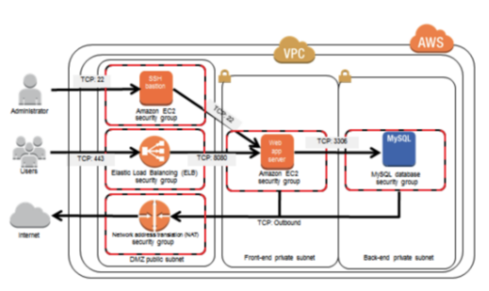

# AWS Secure Infrastructure

Terraform configuration for a secure AWS infrastructure with bastion host, web servers, and RDS.

## Prerequisites
- AWS CLI configured
- Terraform installed
- Access to target AWS account

## Usage
1. Generate secrets:
```bash
./scripts/generate_secrets.sh dev
```

2. Deploy infrastructure:
```bash
cd environments/dev
terraform init
terraform plan
terraform apply
```

3. Cleanup:
```bash
terraform destroy
./scripts/delete_secrets.sh dev
```

## Architecture



### Network Tiers
1. **Public Subnet (DMZ)**
   - Application Load Balancer (HTTPS/443)
   - Bastion Host (SSH/22)
   - NAT Gateway for outbound internet access

2. **Private Application Subnet**
   - Web servers in Auto Scaling Group
   - Inbound: SSH (22) from Bastion, HTTP (80) from ALB
   - Outbound: via NAT Gateway

3. **Private Database Subnet**
   - RDS MySQL instance
   - Inbound: MySQL (3306) from web servers only
   - No internet access

### Traffic Flow
```
Inbound Web: Internet → ALB (443) → Web Servers (80)
Inbound SSH: Internet → Bastion (22) → Web Servers (22)
Outbound:    Web Servers → NAT Gateway → Internet
Database:    Web Servers → RDS (3306)
```

### Components

- **VPC & Networking**
  - Multi-AZ with public/private subnets
  - NAT Gateway in public subnet
  - Internet Gateway for public access

- **Security**
  - Security groups with least-privilege
  - Key-based SSH access only
  - HTTPS for external traffic
  - Encrypted root volumes
  - IMDSv2 requirement

- **Compute**
  - Auto Scaling Group (2-4 instances)
  - Application Load Balancer
  - Bastion host for SSH access

- **Database**
  - RDS MySQL in private subnet
  - Encrypted storage
  - Automated backups

## Structure

```
.
├── modules/
│   ├── vpc/      # Network foundation
│   ├── security/ # Access control
│   ├── compute/  # EC2 resources
│   └── database/ # RDS instance
└── environments/
    └── dev/      # Development env
```

## Access Information

- **Web Application**: `https://<alb-dns-name>`
- **Bastion Access**: `ssh -i <key-path> ec2-user@<bastion-ip>`
- **Database**: Access via web servers only

## Security Notes

- All external traffic is HTTPS
- SSH access via bastion only
- Private resources in private subnets
- No direct database access
- Encrypted storage for sensitive data

## Secrets Management

The infrastructure uses AWS Systems Manager Parameter Store to securely manage sensitive data. The `generate_secrets.sh` script automates the creation of required secrets:

```
/bastion-app/<environment>/
├── database/
│   ├── username     # Database admin username
│   └── password     # KMS-encrypted database password
└── bastion/
    └── ssh_private_key  # KMS-encrypted SSH private key
```

### Secret Generation

The `scripts/generate_secrets.sh` script:
1. Generates secure random passwords for RDS
2. Creates an SSH key pair for bastion access
3. Stores values in SSM Parameter Store using KMS encryption
4. Sets appropriate IAM permissions

Usage:
```bash
# Generate secrets for development environment
./scripts/generate_secrets.sh dev

# Generate secrets for production environment
./scripts/generate_secrets.sh prod
```

**Note**: Run this script before applying Terraform to ensure all required secrets are available.

## Configuration

### Required Variables
```hcl
# environments/dev/terraform.tfvars
environment     = "dev"
aws_region      = "us-west-2"
vpc_cidr        = "10.0.0.0/16"
instance_type   = "t3.micro"
certificate_arn = "arn:aws:acm:REGION:ACCOUNT:certificate/CERTIFICATE-ID"
```

### Network Configuration
- VPC CIDR: `10.0.0.0/16`
- Public Subnets: `10.0.1.0/24`, `10.0.2.0/24`
- Private Subnets: `10.0.3.0/24`, `10.0.4.0/24`

## Monitoring & Maintenance

- **CloudWatch**: EC2 and RDS metrics
- **Health Checks**: ALB target group `/health` endpoint
- **Backups**: RDS automated backups enabled
- **Updates**: Auto-updates enabled on instances

## Cost Estimation

Estimated costs for development environment (US East 1):

### Compute & Network
- **Bastion Host**
  - t3.micro: $0.0104/hour (~$7.50/month)
  - EBS volume (8GB): ~$0.80/month
  - Elastic IP: $0.005/hour (~$3.60/month) when not attached

- **Web Servers** (2-4 instances)
  - t3.micro: $0.0104/hour per instance
    - 2 instances: ~$15/month
    - 4 instances: ~$30/month
  - EBS volumes: ~$0.80/month per instance

- **Load Balancer**
  - ALB: $0.0225/hour (~$16.20/month)
  - LCU usage: ~$10/month (varies with traffic)

- **NAT Gateway**
  - Usage: $0.045/hour (~$32.40/month)
  - Data processing: $0.045/GB

### Database
- **RDS MySQL**
  - db.t3.micro: $0.017/hour (~$12.24/month)
  - Storage (20GB gp3): ~$2.50/month
  - Backup: Included for 100% DB size

### Total Estimated Cost
- **Per Hour**: $0.12-0.15
- **Per Month**: $85-110

*Note: Prices based on US West 2 region, on-demand pricing.*
